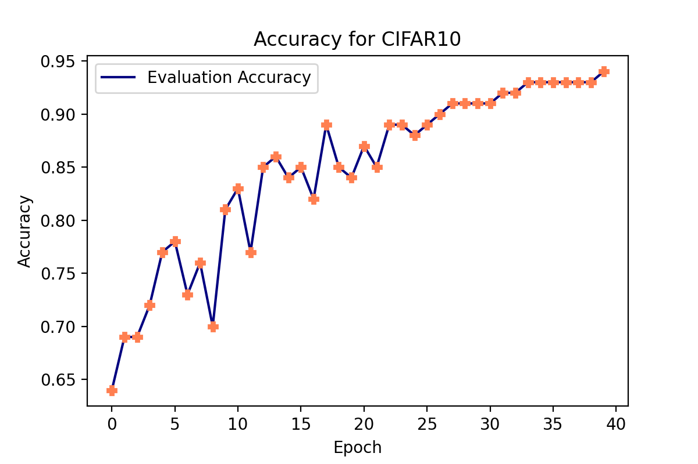
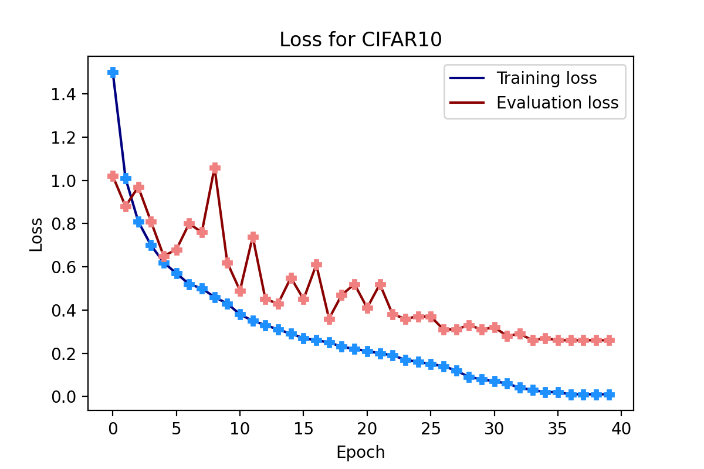
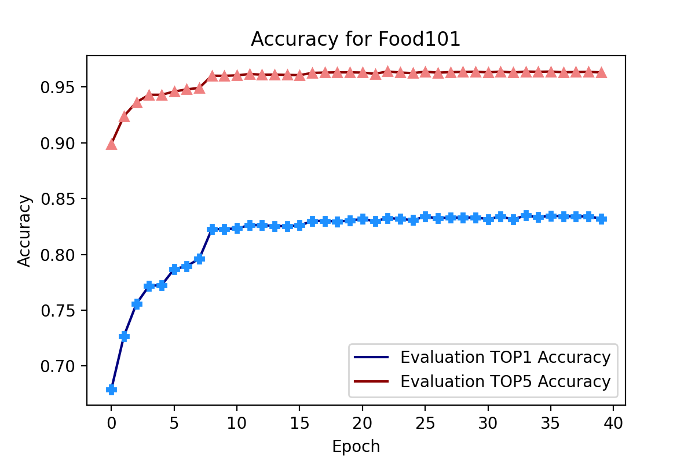
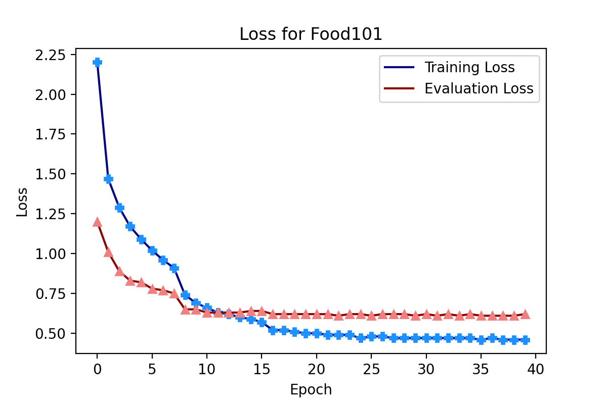

# ResNet Implementation for Food101/CIFAR10 in Pytorch

# Introduction
Work in progress

# Usage
Required library: `torch, torchvision`

For training on CIFAR10 dataset using default parameters
~~~
python cifar10_resnet.py

options:
  -h, --help            show this help message and exit
  --epoch               Number of training epoches
  --batchsize           Size of training batch
  --lr                  Laraning rate
  --weight_decay        Weight decay
  --workers             Number of worker
  --dataset             The path of training data
  --save_checkpoint     True for saving checkpoint during training
  --checkpoint_path     The path for checkpoint
  --print_freq          Print frequency
  --evaluate            Evaluate mode
~~~

For training on Food101 dataset using default parameters
~~~
python food101_resnet.py

optional arguments:
  -h, --help            show this help message and exit
  --epoch               Number of training epoches
  --arch                Architecture of Resnet Model: resnet34, resnet50, resnet101
  --batchsize           Size of training batch
  --lr                  Laraning rate
  --weight_decay        Weight decay
  --workers             Number of worker
  --dataset             The path of training data
  --pretrained          Using imagenet pretrained weights
  --save_checkpoint     True for saving checkpoint during training
  --checkpoint_path     The path for checkpoint
  --print_freq          Print frequency
  --evaluate            Evaluate mode
~~~

# Results

A ResNet9 model was built for CIFAR10, and top1 accuracy 93.51% was obatined after 40 epoches of training. The following results were obatined using default parameters.

Evaluation accuracy during training: 

Loss during training:

A ResNet50 model was built for Food101, and Imagenet pretrained weights was loaded. Using 40 epoches, the highest top1 accuracy I get is 84.23%. The following results were obatined using default parameters.

Evaluation accuracy during training: 

Loss during training:

